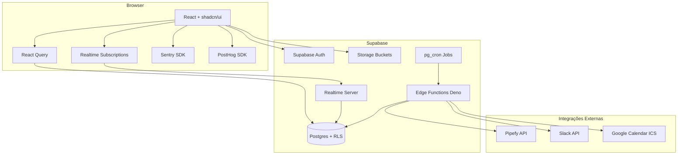
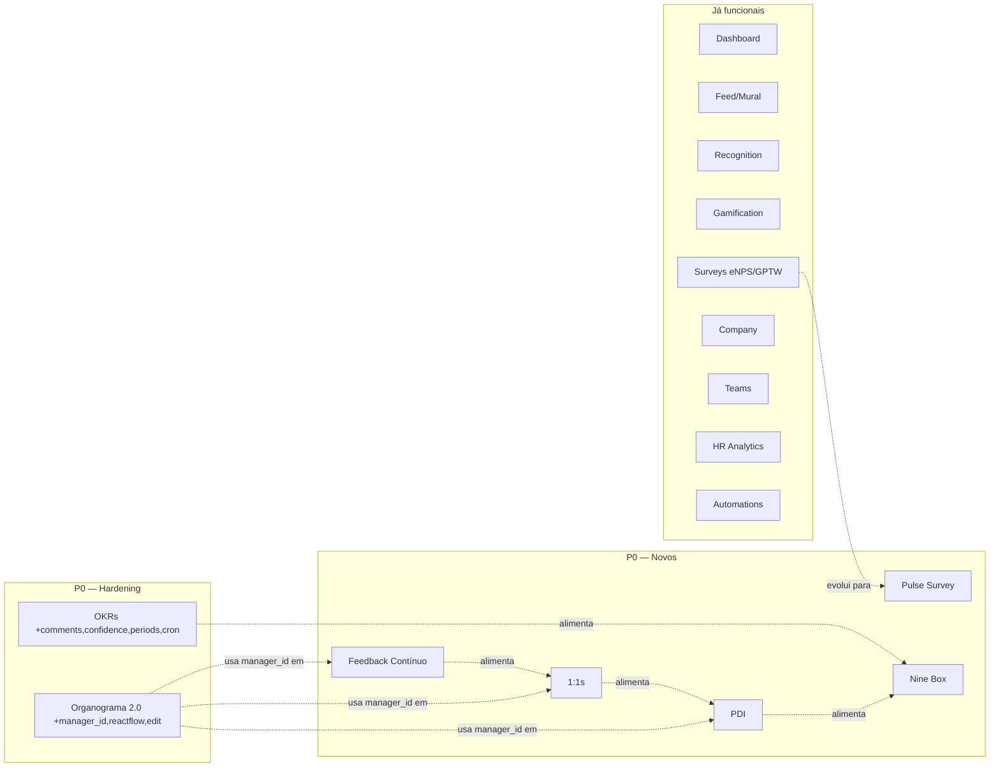

# Architecture Review — oxypeople

**Autor:** Aria (Architect)
**Data:** 2026-04-27
**Input:** `docs/brownfield-assessment.md`
**Objetivo:** Revisar arquitetura atual, identificar fragilidades a corrigir antes/durante o MVP e desenhar a arquitetura dos 7 módulos P0 (OKRs hardening, Organograma 2.0, Feedback contínuo, 1:1s, PDI, Pulse Survey, Nine Box).

---

## 1. Avaliação da Arquitetura Atual

### 1.1 Pontos fortes (manter)

| Camada | Avaliação |
|---|---|
| **Multi-tenant** | Modelo `companies` + `company_memberships` + `user_roles` + helpers `is_company_member()` / `is_company_admin()` é sólido e replicado consistentemente em todas as RLS policies |
| **React Query** | Convenção bem aplicada: `queryKey: [resource, companyId, userId]`, `enabled: !!deps`, invalidação ampla no `onSuccess` |
| **Padrão de Edge Functions** | Deno + Service Role, CORS preflight, `{ success, data?, error? }` |
| **Soft delete + recuperação** | `deleted_at NOT NULL` com `useDeletedItems` + `useRestoreItem` é elegante e reusável |
| **Auditoria de OKRs** | `okr_audit_log` + triggers + UI = padrão a replicar para PDI e Performance |
| **Forms** | Zod por formulário + RHF + `useFieldArray` para arrays dinâmicos |

### 1.2 Pontos frágeis (corrigir antes ou durante MVP)

| # | Fragilidade | Onde | Severidade | Tratamento |
|---|---|---|---|---|
| F1 | **Lovable Auth coexiste com Supabase Auth** mas só Supabase é usado de fato | `src/integrations/lovable/`, `src/pages/Auth.tsx` | 🟡 | Remover Lovable Auth — usar só Supabase |
| F2 | **Sem `manager_id`** — hierarquia de organograma é só "líder de dept → membros" | `users`, `company_memberships` | 🔴 | Adicionar `manager_id` em `company_memberships` (multi-tenant correto) |
| F3 | **Enum TS de objective_type** desincronizado do DB | `useObjectives.ts:10` | 🔴 | Alinhar TS com DB (manter 6 tipos ou simplificar DB para 3) |
| F4 | **RLS permissiva em `reactions` (`SELECT USING (true)`)** | migration de reactions | 🟡 | Restringir por `is_company_member` |
| F5 | **`pg_cron` instalado sem jobs** — `okr-escalation` nunca dispara automático | DB | 🔴 | Criar cron job + admin UI mínima |
| F6 | **Sem central de notificações** — só toast efêmero | `useNotifications` | 🟡 | Sino na topbar com lista persistente + realtime já existente |
| F7 | **Sem testes automatizados** | `src/test/` | 🔴 | Suíte mínima: hooks críticos + RLS + fluxo de auth |
| F8 | **Sem observabilidade** (Sentry, logs estruturados, métricas) | global | 🟡 | Sentry no front + Supabase logs no back |
| F9 | **DELETE policies faltando** em `survey_questions`, `performance_questions`, `performance_answers` | migrations | 🟡 | Adicionar policies aditivas |
| F10 | **`block_manual_progress()` desativado** — confiança em camada de app | OKR triggers | 🟢 | Reativar com session var ou aceitar como design |

> Nenhuma das correções acima exige migration destrutiva. Todas são **aditivas** (ADD COLUMN, CREATE POLICY, CREATE INDEX) ou puramente código de aplicação.

---

## 2. Tech Stack — Decisões Confirmadas

```yaml
frontend:
  framework: Vite + React 18 + TypeScript
  ui: shadcn/ui + Tailwind + Radix
  state: React Query + AuthContext
  forms: react-hook-form + Zod
  drag_drop: "@dnd-kit"          # já em uso
  charts: Recharts
  pdf_export: react-pdf           # NOVO — para export OKRs/Org/Nine Box
  org_chart: reactflow            # NOVO — substituir tree custom; já tem zoom/pan/drag pronto

backend:
  database: Supabase Postgres
  auth: Supabase Auth             # remover Lovable Auth
  realtime: Supabase Realtime
  edge_functions: Supabase Edge (Deno)
  storage: Supabase Storage
  cron: pg_cron                   # ativar jobs
  http: pg_net                    # já instalado, usar para webhooks

observability:
  frontend_errors: Sentry         # NOVO
  product_analytics: PostHog      # NOVO
  backend_logs: Supabase Logs     # nativo

integrations:
  pipefy: edge function           # já existe
  slack: edge function            # já existe
  google_calendar: ICS download   # NOVO — para 1:1s
```

**Decisões "comprar vs construir":**

- **`reactflow`** para Organograma 2.0 — `Map view` de OKRs já implementa zoom/pan/drag manualmente; reactflow padroniza isso e dá export PNG grátis. Vale o custo de 1 dependência.
- **`react-pdf`** para export de relatórios — mais simples que server-side puppeteer.
- **NÃO** adicionar Redux/Zustand — React Query + Context dá conta.
- **NÃO** trocar Supabase por outro BaaS — modelo está maduro e bem usado.

---

## 3. System Design

### 3.1 Visão geral (atualizada com módulos novos)



### 3.2 Módulos do MVP (mapa funcional)



---

## 4. Data Model — Novas Tabelas

### 4.1 Diagrama

```mermaid
erDiagram
    company_memberships ||--o{ company_memberships : "manager_id"
    users ||--o{ feedback_requests : "requester"
    users ||--o{ feedback_requests : "respondent"
    users ||--o{ one_on_ones : "leader"
    users ||--o{ one_on_ones : "member"
    one_on_ones ||--o{ one_on_one_topics : "agenda"
    one_on_ones ||--o{ one_on_one_notes : "notes"
    users ||--o{ pdi_plans : "owner"
    pdi_plans ||--o{ pdi_actions : "actions"
    pdi_plans ||--o{ pdi_competencies : "competencies"
    companies ||--o{ pulse_surveys : ""
    pulse_surveys ||--o{ pulse_responses : ""
    performance_evaluations ||--o{ nine_box_placements : ""
    performance_cycles ||--o{ nine_box_snapshots : ""

    feedback_requests {
        uuid id PK
        uuid company_id FK
        uuid requester_id FK
        uuid respondent_id FK
        uuid subject_user_id FK "para quem é o feedback"
        text question
        text response
        jsonb competency_tags
        text status "requested,answered,declined"
        timestamptz answered_at
    }

    one_on_ones {
        uuid id PK
        uuid company_id FK
        uuid leader_id FK
        uuid member_id FK
        timestamptz scheduled_at
        int duration_minutes
        text status "scheduled,completed,canceled"
        text recurrence "none,weekly,biweekly,monthly"
    }

    one_on_one_topics {
        uuid id PK
        uuid one_on_one_id FK
        uuid created_by FK
        text content
        boolean done
        int order_index
    }

    one_on_one_notes {
        uuid id PK
        uuid one_on_one_id FK
        text content
        text visibility "shared,private_leader,private_member"
        uuid author_id FK
    }

    pdi_plans {
        uuid id PK
        uuid company_id FK
        uuid user_id FK
        uuid manager_id FK
        text title
        text status "draft,active,completed,canceled"
        date target_date
        int progress
    }

    pdi_competencies {
        uuid id PK
        uuid pdi_plan_id FK
        text name
        int current_level "1-5"
        int target_level "1-5"
    }

    pdi_actions {
        uuid id PK
        uuid pdi_plan_id FK
        uuid competency_id FK
        text title
        text status "todo,doing,done"
        date due_date
    }

    pulse_surveys {
        uuid id PK
        uuid company_id FK
        text name
        text frequency "weekly,biweekly,monthly"
        int next_run_day
        text question
        boolean active
    }

    pulse_responses {
        uuid id PK
        uuid pulse_survey_id FK
        uuid user_id FK
        date period
        int score "1-5 ou 0-10"
        text comment
    }

    nine_box_snapshots {
        uuid id PK
        uuid company_id FK
        uuid cycle_id FK
        timestamptz snapshot_at
        uuid created_by FK
    }

    nine_box_placements {
        uuid id PK
        uuid snapshot_id FK
        uuid user_id FK
        int performance_axis "1-3"
        int potential_axis "1-3"
        text justification
    }
```



### 4.2 Mudanças em tabelas existentes (todas aditivas)

| Tabela | Mudança | Justificativa |
|---|---|---|
| `company_memberships` | `+ manager_id uuid REFERENCES users(id)` | Habilitar Organograma 2.0 e 1:1s baseadas em hierarquia matricial real |
| `key_results` | `+ confidence int CHECK (confidence BETWEEN 0 AND 100)` | Padrão moderno de OKR |
| `objectives` | `+ commitment_type text CHECK (commitment_type IN ('committed','aspirational')) DEFAULT 'committed'` | Diferenciação moonshot vs comprometido |
| `objectives` | `+ deleted_at timestamptz` (se ainda não tem) | Coerência com soft-delete pattern |
| `objective_comments` (nova) | tabela dedicada | Reusar `comments` (do feed) cria acoplamento ruim |

---

## 5. Arquitetura por Módulo

### 5.1 OKRs Hardening

**Não cria tabela nova além de `objective_comments`**. Tudo é refinement.

| Frente | Implementação |
|---|---|
| Alinhar enum TS↔DB | Aceitar 6 tipos no enum TypeScript de `useObjectives.ts:10`. Componente `CreateObjectiveDialog` ganha lógica condicional pelos tipos suportados pelo papel do usuário. |
| Comentários | Nova tabela `objective_comments` (id, objective_id, key_result_id nullable, author_id, content, parent_comment_id, created_at, updated_at). RLS: members SELECT, author + admin DELETE. UI: aba "Discussão" no `ObjectiveDetail`. |
| Confidence levels | `key_results.confidence` (0–100). UI: slider no card do KR + badge colorido (>70 verde, 30–70 amarelo, <30 vermelho). |
| Aspirational vs Committed | `objectives.commitment_type`. UI: badge no card + filtro nos `ObjectivesFilters`. Aspirational não conta para média geral. |
| CRUD de períodos | Nova página `/admin/periods` (admin-only) ou painel em `/settings/okrs`. Hook `usePeriodsAdmin` (CRUD). Validação de overlap em SQL trigger. |
| Cron de escalation | `pg_cron` job diário 9h UTC chama `okr-escalation`. UI mostra "Última execução: X" no `OkrSettingsPanel`. |
| Editar colaboradores depois da criação | Nova UI no `ObjectiveDetail`: aba "Colaboradores" com add/remove/role-change. |

**RLS para `objective_comments`:**
```sql
CREATE POLICY "Members view comments" ON objective_comments FOR SELECT
  USING (is_company_member(auth.uid(), (SELECT company_id FROM objectives WHERE id = objective_id)));
CREATE POLICY "Members create comments" ON objective_comments FOR INSERT
  WITH CHECK (author_id = auth.uid() AND is_company_member(auth.uid(), ...));
CREATE POLICY "Author or admin delete" ON objective_comments FOR DELETE
  USING (author_id = auth.uid() OR is_company_admin(auth.uid(), ...));
```

### 5.2 Organograma 2.0

**Mudança estrutural:** adicionar `manager_id` em `company_memberships`.

**Migration aditiva:**
```sql
ALTER TABLE company_memberships
  ADD COLUMN IF NOT EXISTS manager_id uuid REFERENCES users(id) ON DELETE SET NULL;

CREATE INDEX IF NOT EXISTS idx_memberships_manager ON company_memberships(manager_id);

-- View materializada (opcional, para perf em empresas grandes)
CREATE MATERIALIZED VIEW IF NOT EXISTS org_hierarchy AS
  WITH RECURSIVE tree AS (
    SELECT cm.id, cm.user_id, cm.manager_id, cm.company_id, 0 AS depth, ARRAY[cm.user_id] AS path
    FROM company_memberships cm WHERE cm.manager_id IS NULL
    UNION ALL
    SELECT cm.id, cm.user_id, cm.manager_id, cm.company_id, t.depth + 1, t.path || cm.user_id
    FROM company_memberships cm JOIN tree t ON cm.manager_id = t.user_id
  )
  SELECT * FROM tree;
```

**Backend:**
- Hook `useOrganizationHierarchy` reescrito para usar `manager_id` (fallback para depto se NULL — backward compat).
- Hook novo `useUpdateManager(userId, newManagerId)` — admin-only ou self com limite (próprio gestor).

**Frontend:**
- Substituir tree custom por **reactflow** — dá zoom/pan/drag-to-reorder out of the box.
- Click no nó → drawer com perfil (reusar componentes de `/people/`).
- Filtros: por departamento, time, busca por nome.
- Export PNG via reactflow + opção PDF via `react-pdf`.

**Tela admin nova:** `/admin/org-structure` — bulk edit de manager_id (CSV upload? ou tabela editável).

### 5.3 Feedback Contínuo

**Tabela nova:** `feedback_requests`

```sql
CREATE TABLE feedback_requests (
  id uuid PRIMARY KEY DEFAULT gen_random_uuid(),
  company_id uuid NOT NULL REFERENCES companies(id),
  requester_id uuid NOT NULL REFERENCES users(id),    -- quem pede o feedback
  respondent_id uuid NOT NULL REFERENCES users(id),   -- quem deve responder
  subject_user_id uuid NOT NULL REFERENCES users(id), -- sobre quem é o feedback
  question text NOT NULL,
  response text,
  competency_tags jsonb DEFAULT '[]',
  visibility text CHECK (visibility IN ('private', 'shared_with_subject', 'shared_with_manager')) DEFAULT 'shared_with_subject',
  status text CHECK (status IN ('requested', 'answered', 'declined', 'expired')) DEFAULT 'requested',
  due_date date,
  answered_at timestamptz,
  created_at timestamptz DEFAULT now()
);
```

**RLS:** requester, respondent e subject sempre veem; manager do subject vê se `visibility = shared_with_manager`.

**Hooks:**
- `useFeedbackRequests({ direction: 'sent'|'received'|'about_me' })`
- `useCreateFeedbackRequest()`
- `useAnswerFeedback()`

**Notificações:** trigger SQL ao INSERT cria notification para `respondent_id`; ao UPDATE com status='answered' cria para `requester_id` e (conforme visibility) `subject_user_id`.

**UI:** nova rota `/feedback` com 3 tabs (Recebidos / Enviados / Sobre mim). Botão "Pedir Feedback" no perfil de qualquer colaborador.

### 5.4 1:1s

**Tabelas:** `one_on_ones`, `one_on_one_topics`, `one_on_one_notes`

**Padrão de visibilidade:** notas têm `visibility` (`shared` | `private_leader` | `private_member`) — RLS aplica filtro.

**Recorrência:** campo `recurrence` em `one_on_ones`. Edge function `cron-create-recurring-1on1s` cria próxima ocorrência ao completar a atual.

**Integração calendário:** endpoint `/functions/v1/one-on-one-ics?id=XYZ` retorna `.ics` para download (não OAuth Google nesta v1 — manter simples).

**UI:** nova rota `/one-on-ones`:
- Lista de próximas 1:1s
- Detalhe com 3 colunas: Tópicos (drag/drop sortable), Notas Compartilhadas, Notas Privadas
- Histórico colapsável

**Quem vê o quê:**
- Líder ↔ Membro veem `shared`
- Cada um vê só suas notas privadas
- Ninguém mais (nem admin) acessa `private_*`

### 5.5 PDI

**Tabelas:** `pdi_plans`, `pdi_competencies`, `pdi_actions`

**Vínculos cruzados:**
- `pdi_actions` pode referenciar um `feedback_request_id` (ação derivada de feedback)
- `pdi_plans` pode referenciar um `evaluation_id` (PDI gerado a partir de avaliação)

**Workflow:**
1. Colaborador (ou gestor) cria PDI
2. Define competências com nível atual e alvo (1–5)
3. Adiciona ações ligadas a cada competência
4. Status atualiza progresso (% ações done)
5. Gestor aprova / comenta

**UI:**
- Rota `/pdi` (lista dos meus PDIs + dos meus liderados se for gestor)
- Detalhe com competências (radar chart Recharts) e ações (kanban reusando padrão de `actions`)

### 5.6 Pulse Survey

**Tabelas:** `pulse_surveys`, `pulse_responses`

**Diferença para `nps_surveys` existente:**
- Recorrente (não pontual)
- Pergunta única curta
- Score baixa cardinalidade (1–5 ou eNPS 0–10)
- Métricas longitudinais (gráfico de evolução)

**Cron:** `pg_cron` semanal envia notification para todos os ativos da empresa (configurável dia da semana). Edge function `pulse-dispatch` lida.

**UI:**
- Admin: `/admin/pulse` cria/edita/pausa pesquisa, vê resultados (gráfico evolutivo)
- Membro: widget no Dashboard "Como você está se sentindo essa semana?" (1 clique se eNPS visual; 1 input se aberto)

**Reusa:** infra de surveys existente para casos pontuais; pulse é tabela separada para clarity.

### 5.7 Nine Box

**Tabelas:** `nine_box_snapshots`, `nine_box_placements`

**Lógica:**
- Snapshot é um momento congelado de um ciclo de performance
- Placement: cada usuário avaliado tem performance (1–3) × potential (1–3) → célula da matriz 3×3
- Performance pode ser auto-calculada via `performance_evaluations.overall_score` (faixas)
- Potential é input manual do gestor/comitê

**UI:** `/nine-box`:
- Seleciona ciclo
- Matriz 3×3 com avatares dos colaboradores em cada célula
- Drag-and-drop para recategorizar (edita placement)
- Filtros: departamento, time
- Export PDF para reuniões de calibração

**Permissões:** apenas admin e managers vêem; export apenas admin.

---

## 6. Security Architecture

### 6.1 Princípios

1. **RLS em 100% das tabelas novas** — sem exceção
2. **Funções helpers já existentes**: `is_company_member`, `is_company_admin`, `is_team_leader`. Adicionar `is_user_manager(uid, target_user_id)` para checar relação de gestão.
3. **Sem `SECURITY DEFINER` triggers** que façam bypass de RLS sem necessidade explícita
4. **Policies separadas para SELECT, INSERT, UPDATE, DELETE** (não usar `FOR ALL`)
5. **Colunas privadas** (notas pessoais de 1:1) ficam em coluna separada com policy específica, não em JSONB

### 6.2 Nova função helper

```sql
CREATE OR REPLACE FUNCTION public.is_user_manager(manager_uid uuid, subordinate_uid uuid, comp_id uuid)
RETURNS boolean LANGUAGE sql STABLE AS $$
  SELECT EXISTS (
    SELECT 1 FROM company_memberships
    WHERE user_id = subordinate_uid
      AND manager_id = manager_uid
      AND company_id = comp_id
      AND status = 'active'
  );
$$;
```

Usada em RLS de PDI, 1:1, Feedback (visibility=shared_with_manager), Nine Box.

### 6.3 Storage

Novo bucket `pdi-attachments` (privado, signed URLs) para evidências de ações concluídas. Policy de upload: usuário só sobe em `{user_id}/...`.

---

## 7. Deployment & Observabilidade

### 7.1 Deploy atual (manter)

- **Frontend:** Lovable (que hospeda o Vite build)
- **Backend:** Supabase managed
- **CI/CD:** Lovable auto-commit; sem GitHub Actions explícito (verificar)

### 7.2 Adições para MVP

| Item | Escolha | Razão |
|---|---|---|
| **Error tracking** | Sentry | Padrão de mercado, free tier serve |
| **Product analytics** | PostHog | Self-host opcional, eventos + funis + session replay |
| **Status page** | (pular MVP) | Supabase já dá status; criar quando tiver clientes pagos |
| **Backups** | Supabase daily + manual snapshot pré-deploy | Plano Pro do Supabase já dá daily |
| **Logs estruturados** | console.log já vai para Supabase Logs no edge | Suficiente para MVP |

### 7.3 Cron jobs a configurar (`pg_cron`)

```sql
-- OKR escalation: diário 9h UTC (6h BRT)
SELECT cron.schedule('okr-escalation-daily', '0 9 * * *',
  $$ SELECT net.http_post(url := '<edge_url>/okr-escalation', headers := '{"Authorization":"Bearer <service_role>"}') $$);

-- Pulse survey dispatch: configurável (default segunda 9h)
SELECT cron.schedule('pulse-dispatch-weekly', '0 9 * * 1',
  $$ SELECT net.http_post(url := '<edge_url>/pulse-dispatch') $$);

-- Recurring 1:1s: hourly check para criar próximas
SELECT cron.schedule('one-on-one-recurrence', '0 * * * *',
  $$ SELECT net.http_post(url := '<edge_url>/one-on-one-recurrence') $$);

-- Run automations (já existe a função): diário 8h UTC
SELECT cron.schedule('run-automations-daily', '0 8 * * *',
  $$ SELECT net.http_post(url := '<edge_url>/run-automations') $$);
```

> **Importante (regra global):** essas chamadas são `INSERT`/`SELECT`/`UPDATE` em tabelas próprias do app — não tocam dados existentes destrutivamente. A migração para criar os jobs é aditiva.

---

## 8. Decision Log

| ID | Decisão | Opções consideradas | Escolhida | Rationale |
|---|---|---|---|---|
| ADR-001 | Onde fica `manager_id` | (a) `users.manager_id`; (b) `company_memberships.manager_id`; (c) tabela separada `manager_relations` | **(b)** | Mantém multi-tenant correto (pessoa pode trabalhar em 2 empresas); evita tabela órfã |
| ADR-002 | Lib de organograma | (a) tree custom (atual); (b) reactflow; (c) react-organizational-chart | **(b) reactflow** | Dá zoom/pan/drag/export PNG out-of-the-box; já é padrão React; bundle aceitável (~150KB) |
| ADR-003 | Comentários em OKRs | (a) reusar `comments` do feed; (b) tabela `objective_comments` | **(b)** | Reuso adicionaria coluna polimórfica (`commentable_type`) — mais complexo. Tabela dedicada é mais limpa. |
| ADR-004 | Pulse Survey dedicado vs reuso de surveys | (a) novo módulo; (b) flag `recurring` em `surveys` | **(a)** | Schema fica mais simples; UX é diferente (widget no header vs página dedicada); gráfico longitudinal pede schema próprio |
| ADR-005 | 1:1 com integração Google Calendar | (a) só ICS download; (b) OAuth Google completo; (c) sem calendário | **(a)** | OAuth Google é semanas de trabalho; ICS resolve 80% dos casos; v2 adiciona OAuth |
| ADR-006 | Lovable Auth | (a) manter por compat; (b) remover | **(b)** | Dead code aumenta superfície de bugs; só Supabase Auth é usado |
| ADR-007 | Nine Box: performance auto-calc | (a) auto via `overall_score`; (b) sempre manual; (c) auto + override | **(c)** | Calibração humana é parte do processo; auto inicial acelera 80% dos casos |
| ADR-008 | Notas privadas em 1:1 | (a) campo único + flag; (b) tabela separada; (c) coluna por visibilidade | **(a)** | Schema simples, RLS resolve via `visibility` field; menos joins |
| ADR-009 | Observabilidade | (a) só Supabase logs; (b) Sentry; (c) Sentry + PostHog | **(c)** | Sentry para erro, PostHog para uso. Custo ~$0 no free tier do tamanho atual |
| ADR-010 | View materializada para org tree | (a) recursive CTE on demand; (b) materialized view com refresh; (c) cache em React Query | **(a) inicialmente, (b) se >500 pessoas/empresa** | Premature optimization até ter cliente com 500+; CTE recursiva resolve fácil |
| ADR-011 | Manter Lovable como hosting | (a) manter; (b) migrar para Vercel/Cloudflare | **(a) por agora** | Migração não agrega valor pré-revenue; Lovable já tem CI/CD funcionando |
| ADR-012 | PDI vinculado a evaluation | (a) FK opcional `evaluation_id`; (b) tabela junção; (c) sem vínculo | **(a)** | Vínculo direto é simples e cobre o caso comum |

---

## 9. Roadmap Técnico (alinhado ao Sprint Plan do assessment)

### Sprint 0 (preparação — pode rodar em paralelo)
- F1: remover Lovable Auth dead code
- F4, F9: corrigir RLS de `reactions` + adicionar DELETE policies em surveys/performance
- Setup Sentry + PostHog
- Setup pg_cron jobs (apenas o de `okr-escalation` que já existe)
- Bootstrap testes: vitest + supabase-js mock + 1 hook como exemplo

### Sprint 1 — OKRs hardening
- ADR-003: criar `objective_comments` + UI de discussão
- F3: alinhar enum TS↔DB
- Adicionar `confidence` em key_results + UI slider
- Adicionar `commitment_type` em objectives + filtro
- Tela admin de períodos (CRUD)
- Editar colaboradores no ObjectiveDetail

### Sprint 2 — Organograma 2.0 + Pulse + Nine Box
- ADR-001: migration aditiva `manager_id`
- ADR-002: substituir tree custom por reactflow
- Tela admin de bulk edit de gestores
- Pulse: tabelas + cron + widget no Dashboard + admin
- Nine Box: tabelas + matriz + drag-drop + export PDF

### Sprint 3 — Feedback contínuo + 1:1s
- Feedback: tabelas + RLS + página /feedback + notificações
- 1:1: tabelas + RLS por visibilidade + página /one-on-ones + ICS
- Edge function de recorrência

### Sprint 4 — PDI + qualidade
- PDI: tabelas + RLS + página /pdi + radar chart + kanban de ações
- Suíte de testes mínima (cobertura crítica)
- Central de notificações (sino na topbar)

### Sprint 5 — Hardening
- Mood widget
- Jornada do colaborador (timeline agregada)
- Polish, bugs, docs

---

## 10. Riscos Arquiteturais & Mitigações

| Risco | Probabilidade | Impacto | Mitigação |
|---|---|---|---|
| **reactflow conflita com @dnd-kit** existente | Baixa | Médio | Confinar reactflow ao Organograma; @dnd-kit segue em Kanban/PDI |
| **`manager_id` quebra hooks existentes** | Média | Alto | Manter fallback para `dept.leader_id` por 2 sprints; remover quando todas pessoas tiverem manager preenchido |
| **pg_cron disponível só no Supabase Pro** | Média | Médio | Verificar plano atual; se Free, usar Vercel cron ou GitHub Actions schedule chamando edge functions |
| **PostHog/Sentry sobrecarregam free tier** | Baixa | Baixo | Rate limit de eventos; sample 10% em prod |
| **Notificações em massa via cron sobrecarrega Supabase** | Média | Alto | Bulk insert em batches de 100; rate limit em edge function |
| **react-pdf bundle gigante** | Baixa | Médio | Lazy load com `React.lazy` apenas nas páginas de export |
| **1:1 com notas privadas vaza por bug RLS** | Baixa | **Crítico** | Testes de RLS obrigatórios para tabelas com `visibility`; revisão extra da policy |

---

## 11. Recomendações Finais para o PM

1. **Aprovar este review** ou pedir ajustes nas decisões (ADRs 1–12).
2. Avançar para **`/agents:data-engineer` (Dara)** para detalhar migrations das novas tabelas com RLS prontas (sem aplicar — só preparar).
3. Em paralelo, **`/agents:pm` (Morgan)** pode iniciar o PRD usando este review como base técnica, definindo success metrics por módulo.
4. Decisões pendentes que ainda dependem do usuário:
   - [ ] Confirmar **ADR-001** (`manager_id` em `company_memberships`)
   - [ ] Confirmar **ADR-002** (adicionar reactflow)
   - [ ] Confirmar **ADR-006** (remover Lovable Auth)
   - [ ] Confirmar **ADR-009** (Sentry + PostHog — tem orçamento?)
   - [ ] Confirmar plano do Supabase (`pg_cron` precisa Pro?)

---

**Status:** ✅ Architecture review pronto, aguardando aprovação para avançar a Dara (Data Engineer) ou direto a Morgan (PM).
