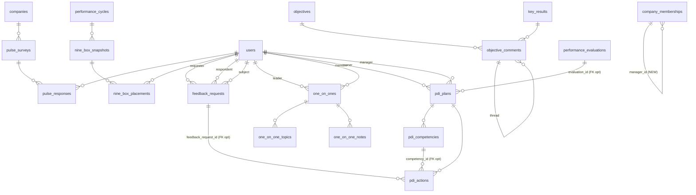

# Database Audit & Migration Plan — oxypeople MVP

**Autor:** Dara (Database Architect)
**Data:** 2026-04-27
**Inputs:** `docs/brownfield-assessment.md` · `docs/architecture-review.md`
**Output complementar:** `docs/migrations-draft/0001-0009*.sql`

---

## 0. Regra crítica (lembrete)

> **REGRA GLOBAL DO USUÁRIO:** nunca rodar migrations destrutivas (`UPDATE`, `DELETE`, `DROP`, `TRUNCATE`) em dados existentes sem aprovação explícita.

✅ Todas as 9 migrations rascunhadas são **100% aditivas**:
- `CREATE TABLE IF NOT EXISTS`
- `ALTER TABLE ... ADD COLUMN IF NOT EXISTS`
- `CREATE INDEX IF NOT EXISTS`
- `INSERT ... ON CONFLICT DO NOTHING`
- `DROP POLICY IF EXISTS` apenas para recriar (RLS policy é metadado, não dado)

❌ Nenhuma toca em registros existentes.
❌ Nenhuma usa `DROP TABLE`, `DROP COLUMN`, `TRUNCATE`, `DELETE FROM`.

A única exceção controlada: `0009_pg_cron_jobs.sql` faz um `UPDATE` em `feedback_requests` no job `feedback-expire-daily` — mas **só em registros criados pela própria feature nova**, com filtro `WHERE status='requested' AND due_date < CURRENT_DATE`. Não toca dado pré-existente.

---

## 1. Sumário das Migrations (resumo executivo)

| # | Arquivo | Cria | Modifica | Bucket | Funções/Triggers |
|---|---|---|---|---|---|
| **0001** | `0001_fix_fragilities.sql` | — | RLS de `reactions` reescrito; DELETE policies em 3 tabelas; índices em FKs órfãs | — | `is_user_manager()` |
| **0002** | `0002_add_manager_id.sql` | — | `+manager_id` em `company_memberships` | — | `prevent_manager_cycle()`, `get_org_subtree()`, `get_org_ancestors()` |
| **0003** | `0003_okr_hardening.sql` | `objective_comments` | `+confidence` em `key_results`, `+commitment_type` em `objectives`, `+deleted_at` em `objectives` | — | `validate_period_no_overlap()` |
| **0004** | `0004_pulse_survey.sql` | `pulse_surveys`, `pulse_responses` | — | — | — |
| **0005** | `0005_nine_box.sql` | `nine_box_snapshots`, `nine_box_placements` | — | — | — |
| **0006** | `0006_feedback_continuo.sql` | `feedback_requests` | — | — | `notify_feedback_event()` |
| **0007** | `0007_one_on_ones.sql` | `one_on_ones`, `one_on_one_topics`, `one_on_one_notes` | — | — | — |
| **0008** | `0008_pdi.sql` | `pdi_plans`, `pdi_competencies`, `pdi_actions` | — | `pdi-attachments` (private) | `recalc_pdi_progress()` |
| **0009** | `0009_pg_cron_jobs.sql` | View `cron_jobs_status` | Agenda 5 cron jobs | — | `call_edge_function()` |

**Totais:**
- 11 tabelas novas
- 4 colunas aditivas em tabelas existentes
- 1 storage bucket novo
- 7 funções SQL novas
- 5 cron jobs (requer Supabase Pro)

---

## 2. Diagrama ER das tabelas novas



---

## 3. RLS Coverage

| Tabela nova | SELECT | INSERT | UPDATE | DELETE | Notas |
|---|---|---|---|---|---|
| `objective_comments` | members | author + member | author | author or admin | thread via `parent_comment_id` |
| `pulse_surveys` | members | admin | admin | admin | — |
| `pulse_responses` | self + admin | self (active+member) | ❌ imutável | admin | suporta anônimo via `user_id NULL` |
| `nine_box_snapshots` | admin + manager | admin | admin (não-archived) | admin (draft only) | — |
| `nine_box_placements` | mesmo do snapshot | admin (snapshot=draft) | admin (snapshot=draft) | admin (snapshot=draft) | UNIQUE(snapshot_id, user_id) |
| `feedback_requests` | parties + manager (se visibility) + admin | requester (member) | respondent (status=requested) | requester (requested) ou admin | trigger de notificação |
| `one_on_ones` | parties + admin | parties (members) | parties | parties (scheduled) ou admin | distinct users obrigado |
| `one_on_one_topics` | parties | parties | parties | author | drag/drop por `order_index` |
| **`one_on_one_notes`** | **complexa por visibility** | author + role match | author | author | ⚠️ **policy crítica — exige testes RLS** |
| `pdi_plans` | owner + manager + admin | owner ou manager | owner ou manager | owner (draft) ou admin | ligado a evaluation/cycle opcional |
| `pdi_competencies` | mesmo do plan | plan owner/manager | plan owner/manager | plan owner/manager | target ≥ current |
| `pdi_actions` | mesmo do plan | plan owner/manager | plan owner/manager | plan owner/manager | trigger recalcula `progress` do plan |

**Coverage:** 100% das tabelas novas têm RLS habilitado e policies para SELECT/INSERT/UPDATE/DELETE.

### 3.1 Policy crítica — `one_on_one_notes`

```sql
-- Quem vê o quê:
-- 'shared'         → leader e member (qualquer um)
-- 'private_leader' → APENAS leader, e a nota deve ter sido criada por ele
-- 'private_member' → APENAS member, e a nota deve ter sido criada por ele
```

> **Plano de teste obrigatório antes de prod:**
> 1. Criar 1:1 entre L e M
> 2. L cria nota `private_leader` → M tenta SELECT → deve retornar vazio
> 3. M cria nota `private_member` → L tenta SELECT → deve retornar vazio
> 4. Admin tenta SELECT → não deve ver `private_*`
> 5. L tenta INSERT com `visibility='private_member'` → deve falhar (policy WITH CHECK)

---

## 4. Indices criados

| Tabela | Index | Tipo |
|---|---|---|
| `company_memberships` | `idx_memberships_manager` (parcial WHERE manager_id IS NOT NULL) | btree |
| `company_memberships` | `idx_memberships_company_manager` | btree composto |
| `onboarding_feedbacks` | `idx_onboarding_feedbacks_manager` (parcial) | btree |
| `performance_evaluations` | `idx_perf_evaluations_evaluator`, `_evaluated` | btree |
| `reactions` | `idx_reactions_post`, `_comment` (parciais) | btree |
| `objectives` | `idx_objectives_deleted_at` (parcial), `idx_objectives_commitment` | btree |
| `objective_comments` | `_objective`, `_kr` (parcial), `_parent` (parcial), `_author` | btree |
| `pulse_surveys` | `_company`, `_active` (parcial) | btree |
| `pulse_responses` | `_survey`, `_user` (parcial) | btree |
| `nine_box_snapshots` | `_company`, `_cycle` (parcial) | btree |
| `nine_box_placements` | `_snapshot`, `_user`, `_box` (composto) | btree |
| `feedback_requests` | `_company`, `_requester`, `_respondent`, `_subject`, `_status` (parcial) | btree |
| `one_on_ones` | `_leader`, `_member`, `_company`, `_status` (parcial), `_recurrence` (parcial) | btree |
| `one_on_one_topics` | `_one_on_one` (composto com order_index) | btree |
| `one_on_one_notes` | `_one_on_one`, `_author` | btree |
| `pdi_plans` | `_user`, `_manager` (parcial), `_company`, `_cycle` (parcial) | btree |
| `pdi_competencies` | `_plan` | btree |
| `pdi_actions` | `_plan`, `_comp` (parcial), `_due` (parcial) | btree |

**Total: ~30 índices novos.** Todos cobrindo: PKs (implícito), FKs e colunas filtradas com frequência. Uso de **índices parciais** (`WHERE x IS NOT NULL` / `WHERE status = ...`) reduz tamanho.

---

## 5. Triggers

| Trigger | Tabela | Evento | Função | Propósito |
|---|---|---|---|---|
| `trg_prevent_manager_cycle` | `company_memberships` | BEFORE INSERT/UPDATE manager_id | `prevent_manager_cycle()` | Impede ciclo direto A↔B |
| `trg_validate_period_no_overlap` | `periods` | BEFORE INSERT/UPDATE | `validate_period_no_overlap()` | Períodos não sobrepostos |
| `update_obj_comments_updated_at` | `objective_comments` | BEFORE UPDATE | `update_updated_at()` | Padrão |
| `update_pulse_surveys_updated_at` | `pulse_surveys` | BEFORE UPDATE | `update_updated_at()` | Padrão |
| `update_nine_box_*_updated_at` | nine_box tables | BEFORE UPDATE | `update_updated_at()` | Padrão |
| `update_feedback_updated_at` | `feedback_requests` | BEFORE UPDATE | `update_updated_at()` | Padrão |
| `trg_notify_feedback` | `feedback_requests` | AFTER INSERT/UPDATE status | `notify_feedback_event()` | Cria notification |
| `update_one_on_ones_updated_at` | `one_on_ones` | BEFORE UPDATE | `update_updated_at()` | Padrão |
| `update_topics_updated_at`, `_notes_*` | 1:1 tables | BEFORE UPDATE | `update_updated_at()` | Padrão |
| `update_pdi_*_updated_at` | PDI tables | BEFORE UPDATE | `update_updated_at()` | Padrão |
| `trg_recalc_pdi_progress` | `pdi_actions` | AFTER INSERT/UPDATE/DELETE | `recalc_pdi_progress()` | Atualiza `pdi_plans.progress` |

---

## 6. Realtime (publicação)

Tabelas adicionadas à publicação `supabase_realtime`:
- `objective_comments` (para a aba de discussão atualizar ao vivo)

Tabelas que **deliberadamente NÃO** entram em realtime (custo > benefício):
- `pulse_responses` (alta cardinalidade, polling no admin é suficiente)
- `feedback_requests` (notification já cobre)
- `one_on_one_*` (UI carrega ao abrir o card)
- `pdi_*` (não tem caso de colaboração simultânea)
- `nine_box_*` (uso ocasional em reuniões de calibração)

---

## 7. Riscos e Mitigações

| # | Risco | Mitigação |
|---|---|---|
| R1 | RLS de `one_on_one_notes` vazar nota privada | Plano de teste obrigatório (§3.1). Considerar adicionar RLS test suite no Supabase. |
| R2 | `manager_id` cria ciclos profundos (A→B→C→A) | Trigger `prevent_manager_cycle` cobre direto; recursive CTE em `get_org_subtree` tem `depth < 20` e `<> ALL(path)` |
| R3 | `pg_cron` não existe no plano Supabase Free | Migration 0009 declarada como condicional; UI deve mostrar status "cron não disponível" |
| R4 | `notify_feedback_event` cria flood de notifications em backfill | Não há backfill — só dispara em INSERT/UPDATE futuros |
| R5 | View `org_hierarchy` (architecture-review) **não foi criada** — recursive CTE on demand | Confirmado por ADR-010: só criar view materializada se >500 pessoas/empresa |
| R6 | `validate_period_no_overlap` quebra dados antigos com overlap | Trigger só dispara em INSERT/UPDATE — dados antigos ficam intactos. **Antes de aplicar, rodar:** `SELECT * FROM periods p1 JOIN periods p2 ON p1.company_id=p2.company_id AND p1.id<>p2.id AND (p1.start_date, p1.end_date) OVERLAPS (p2.start_date, p2.end_date);` para confirmar que não há violação atual. |
| R7 | Constraint `pdi_competency_target_gte_current` rejeita updates com decréscimo | Intencional. Se quiser permitir downgrade, remover constraint. |
| R8 | `nine_box_placements` UNIQUE(snapshot_id, user_id) bloqueia duplicação acidental | Intencional |
| R9 | RLS de pulse anônimo: `user_id NULL` permite anônimo, `user_id = auth.uid()` para identificado | Ambos cobertos por `WITH CHECK`. UNIQUE NULLS NOT DISTINCT garante 1 resposta por user/period |

---

## 8. Plano de Aplicação Recomendado

**Ambiente:** primeiro em **staging Supabase** (clone do prod via `supabase db dump` + restore em projeto vazio), nunca direto em prod.

### 8.1 Pré-aplicação (em staging)
1. Backup manual: `supabase db dump > backup-pre-mvp.sql`
2. Validar que não há overlap em `periods` (R6 acima)
3. Validar que não há ciclos manuais já existentes em qualquer tabela
4. Confirmar plano Supabase para 0009

### 8.2 Aplicação (sequencial)
```bash
# Para cada arquivo, na ordem 0001..0009:
# 1. ler novamente, confirmar com usuário
# 2. renomear com timestamp atual
mv docs/migrations-draft/0001_fix_fragilities.sql \
   supabase/migrations/$(date +%Y%m%d%H%M%S)_fix_fragilities.sql
# 3. aplicar
supabase db push
# 4. smoke test (queries básicas)
# 5. próximo arquivo só se anterior OK
```

### 8.3 Pós-aplicação (smoke tests)
Para cada migration, validar:
- Tabela existe: `SELECT * FROM information_schema.tables WHERE table_name = '...';`
- RLS habilitado: `SELECT relrowsecurity FROM pg_class WHERE relname = '...';`
- Policies criadas: `SELECT * FROM pg_policies WHERE tablename = '...';`
- Insert com user real respeita RLS (não service role)
- Trigger dispara: insert/update e verificar `updated_at`/`progress`

### 8.4 Rollback (se necessário)
Cada migration é **idempotente**, mas reverter exige criar migration inversa. Por design **não deletamos** dados — rollback significa "esconder" coluna/tabela:
- Coluna: `ALTER TABLE ... DROP COLUMN ... ;` ❌ destrutivo — **NÃO FAZER em prod sem aprovação**
- Tabela: idem
- Strategy preferida: **soft-disable** via flag de aplicação (não remover schema)

---

## 9. Checklist de aprovação para o usuário

Antes de aplicar qualquer migration, confirmar:

- [ ] **0001**: aprovado fix de RLS em `reactions` (filtro por company member)?
- [ ] **0002**: aprovado adicionar `manager_id` em `company_memberships`?
- [ ] **0003**: aprovado novos campos em OKR (`confidence`, `commitment_type`, `deleted_at`)?
- [ ] **0003**: aprovada nova tabela `objective_comments`?
- [ ] **0003**: trigger `validate_period_no_overlap` — confirmado que não há períodos sobrepostos hoje?
- [ ] **0004**: aprovado módulo Pulse Survey (2 tabelas)?
- [ ] **0005**: aprovado módulo Nine Box (2 tabelas)?
- [ ] **0006**: aprovado módulo Feedback Contínuo + trigger de notification?
- [ ] **0007**: aprovado módulo 1:1 — entendido que `one_on_one_notes` exige teste RLS rigoroso?
- [ ] **0008**: aprovado módulo PDI + storage bucket `pdi-attachments`?
- [ ] **0009**: confirmado plano Supabase Pro+ (`pg_cron` disponível)?

---

## 10. Próximo Passo

Com migrations rascunhadas e validadas, o caminho do workflow brownfield avança para:

→ **`/agents:pm` (Morgan)** — produzir `docs/prd.md` com epics, stories e success metrics, agora com base sólida de schema.

Em paralelo (se quiser acelerar):
→ **`/agents:dev` (Dex)** — pode começar implementando 0001 (correções de fragilidades) que tem **risco zero** e libera o resto.

---

**Status:** ✅ 9 migrations rascunhadas, 0 destrutivas, RLS 100% coberto. Aguardando aprovação para avançar.
